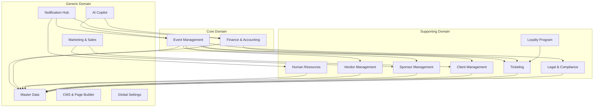
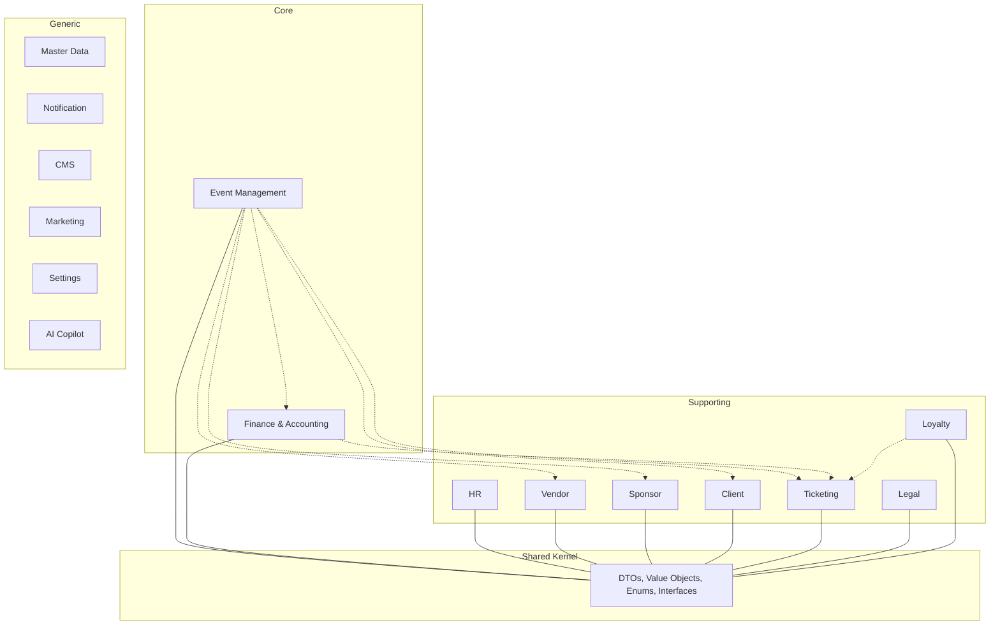

# DOMAIN & BOUNDED CONTEXT — NARA ERP

> **Nama File:** `DNA_08_DOMAIN_CONTEXT.md`
> **Kode Dokumen:** `DOC-DDD`
> **Sifat:** Referensi Stabil
> **Versi:** 2.0.0 — Adaptasi ke Struktur Baru
> **Rujuk ke:** [DNA_07_BUSINESS_RULES.md](./DNA_07_BUSINESS_RULES.md), [DNA_09_MASTER_DATA.md](./DNA_09_MASTER_DATA.md), [DNA_10_FORM_SPEC.md](./DNA_10_FORM_SPEC.md), [DNA_11_DATABASE_SCHEMA.md](./DNA_11_DATABASE_SCHEMA.md)

---

## 1. Peta Domain Utama

---

## 2. Definisi Bounded Context

### 2.1 Master Data (MDM)

| Atribut | Deskripsi |
|---|---|
| **Jenis** | Generic Domain |
| **Tanggung Jawab** | Menyediakan data referensi tunggal untuk seluruh sistem. Semua dropdown, pilihan, dan data master berasal dari context ini. |
| **Entitas Utama** | `Company`, `Currency`, `CountryRegion`, `UnitOfMeasure`, `Department`, `Position`, `EmploymentStatus`, `Bank`, `ChartOfAccount`, `TaxCode`, `PaymentMethod`, `EventCategory`, `Venue`, `VendorCategory`, `SponsorTier`, `ClientIndustry`, `LeadSource`, `TicketType`, `DocumentType`, `PermitType`, `LoyaltyTier`, `RewardType`, `NotificationType`, `Role`, `Permission` |
| **Aturan** | Data master hanya bisa diubah oleh role dengan permission `manage:settings`. Data yang sudah digunakan tidak bisa dihapus, hanya dinonaktifkan. |

### 2.2 Event Management

| Atribut | Deskripsi |
|---|---|
| **Jenis** | Core Domain |
| **Tanggung Jawab** | Mengelola seluruh siklus hidup event: pembuatan via wizard, RAB, timeline, checklist, vendor, sponsor, artis/narasumber, dan publikasi. |
| **Aggregate Root** | `Event` |
| **Entitas** | `Event`, `RABItem`, `TimelineTask`, `ChecklistItem`, `EventArtist`, `EventVendor`, `EventSponsor`, `Brief` |
| **Value Object** | `EventType` (promotor / client_event), `EventStatus` (draft / published / in_progress / completed / archived) |
| **Aturan** | Project Type (`promotor` vs `client_event`) menentukan branching wizard dan modul yang aktif. Publikasi event memicu Efek Domino (notifikasi ke Finance, Vendor, Legal). |

### 2.3 Finance & Accounting

| Atribut | Deskripsi |
|---|---|
| **Jenis** | Core Domain |
| **Tanggung Jawab** | Mencatat semua transaksi keuangan dengan prinsip double-entry accounting. Mengelola Chart of Accounts, General Ledger, Invoice, Purchase Order, Petty Cash, Payroll, Pajak, dan Refund. |
| **Aggregate Root** | `JournalEntry` |
| **Entitas** | `JournalEntry`, `Invoice`, `PurchaseOrder`, `FinanceTransaction`, `RefundRequest` |
| **Value Object** | `Money` (amount + currency), `AccountType` (DEBIT / CREDIT), `ApprovalStatus` (pending / level1_approved / level2_approved / approved / rejected) |
| **Aturan** | Setiap journal entry harus seimbang (total DEBIT = total CREDIT). Semua operasi double-entry wajib menggunakan database transaction. Refund dicatat sebagai journal entry. |

### 2.4 Human Resources (HRIS)

| Atribut | Deskripsi |
|---|---|
| **Jenis** | Supporting Domain |
| **Tanggung Jawab** | Mengelola data karyawan tetap, tenaga lepas, jadwal kru, honor, dan rekrutmen. |
| **Aggregate Root** | `Employee` |
| **Entitas** | `Employee`, `Freelancer`, `CrewSchedule`, `Honor` |
| **Value Object** | `EmploymentType` (KARTAP / PKWT / FREELANCE) |
| **Aturan** | Conflict detection: crew yang sudah dijadwalkan di event lain tidak bisa ditugaskan di event yang sama tanggalnya. |

### 2.5 Vendor Management

| Atribut | Deskripsi |
|---|---|
| **Jenis** | Supporting Domain |
| **Tanggung Jawab** | Mengelola data vendor, brief, penawaran, dan evaluasi performa. |
| **Aggregate Root** | `Vendor` |
| **Entitas** | `Vendor`, `VendorOffer` |
| **Value Object** | `VendorRating` (1-5) |
| **Aturan** | Vendor hanya bisa melihat brief dan invoice milik sendiri. PM dapat mengirim brief ke vendor yang terpilih. |

### 2.6 Sponsor Management

| Atribut | Deskripsi |
|---|---|
| **Jenis** | Supporting Domain |
| **Tanggung Jawab** | Mengelola proposal sponsorship, tier sponsor, dan laporan dampak pasca-acara. |
| **Aggregate Root** | `Sponsor` |
| **Entitas** | `Sponsor`, `Proposal` |
| **Value Object** | `SponsorTier` (Platinum / Gold / Silver) |
| **Aturan** | Modul ini hanya aktif untuk event dengan `project_type: promotor`. Sponsor hanya bisa melihat proposal dan laporan milik sendiri. |

### 2.7 Client Management

| Atribut | Deskripsi |
|---|---|
| **Jenis** | Supporting Domain |
| **Tanggung Jawab** | Mengelola data klien, RFP pipeline, progres proyek, dan invoice klien. |
| **Aggregate Root** | `Client` |
| **Entitas** | `Client`, `RFP` |
| **Value Object** | `ClientIndustry` |
| **Aturan** | Modul ini aktif untuk event dengan `project_type: client_event`. Klien hanya bisa melihat proyek milik sendiri. |

### 2.8 Ticketing

| Atribut | Deskripsi |
|---|---|
| **Jenis** | Supporting Domain |
| **Tanggung Jawab** | Mengelola tiket, Kode Booking, QR Code, checkout, check-in, dan refund. |
| **Aggregate Root** | `Booking` (Kode Booking) |
| **Entitas** | `Booking`, `Ticket`, `WalkinAttendee`, `RefundRequest` |
| **Value Object** | `TicketStatus` (pending / issued / used / refunded / cancelled), `TicketType` (VIP / Festival / Early Bird) |
| **Aturan** | 1 Kode Booking menaungi 1..N Tiket. Setiap tiket memiliki NIK peserta masing-masing. Refund hanya oleh pemilik Kode Booking. Check-in menggunakan QR Code. Batas pembelian ditegakkan per NIK. |

### 2.9 Legal & Compliance

| Atribut | Deskripsi |
|---|---|
| **Jenis** | Supporting Domain |
| **Tanggung Jawab** | Mengelola SOP, kontrak digital, perizinan acara, dan kepatuhan UU PDP. |
| **Aggregate Root** | `SOP` |
| **Entitas** | `SOP`, `LegalContract`, `LegalPermit`, `SOPVersion` |
| **Value Object** | `SOPStatus` (draft / approved / deprecated) |
| **Aturan** | Setiap revisi SOP membuat versi baru. Versi lama tetap dapat dibaca. |

### 2.10 Loyalty Program

| Atribut | Deskripsi |
|---|---|
| **Jenis** | Supporting Domain |
| **Tanggung Jawab** | Mengelola poin loyalitas, tier peserta, dan reward yang bisa ditukar. |
| **Aggregate Root** | `LoyaltyAccount` |
| **Entitas** | `LoyaltyAccount`, `Reward`, `PointTransaction` |
| **Value Object** | `LoyaltyTier` (Basic / Premium / Elite) |
| **Aturan** | Poin otomatis bertambah dari pembelian tiket. Tier naik berdasarkan akumulasi poin. |

### 2.11 Notification Hub

| Atribut | Deskripsi |
|---|---|
| **Jenis** | Generic Domain |
| **Tanggung Jawab** | Mengelola template notifikasi dan pengiriman via email, WhatsApp, dan in-app. |
| **Entitas** | `Notification`, `NotificationTemplate` |
| **Value Object** | `DeliveryChannel` (Email / WA / InApp) |
| **Aturan** | Notifikasi dipicu oleh event dari context lain (Event Published, Transaction Approved, dll.). |

### 2.12 CMS & Page Builder

| Atribut | Deskripsi |
|---|---|
| **Jenis** | Generic Domain |
| **Tanggung Jawab** | Mengelola konten halaman publik (Landing Page, About, Blog, Portfolio) tanpa menyentuh kode. |
| **Entitas** | `Page`, `BlogPost`, `PortfolioItem` |
| **Aturan** | Konten publik tidak boleh menyebut istilah teknis (software, platform, AI). |

### 2.13 Marketing & Sales

| Atribut | Deskripsi |
|---|---|
| **Jenis** | Generic Domain |
| **Tanggung Jawab** | Mengelola pipeline penjualan, prospek, proposal, dan kampanye email. |
| **Entitas** | `Lead`, `SalesPipeline`, `Campaign` |
| **Value Object** | `LeadSource`, `PipelineStage` |

### 2.14 Global Settings

| Atribut | Deskripsi |
|---|---|
| **Jenis** | Generic Domain |
| **Tanggung Jawab** | Menyediakan pengaturan terpusat untuk seluruh sistem: profil perusahaan, default keuangan, API keys, feature flags, refund policy. |
| **Entitas** | `GlobalSetting` |
| **Aturan** | Hanya Super Admin dan COO yang bisa mengubah. Feature flags menentukan modul mana yang aktif. |

### 2.15 AI Copilot

| Atribut | Deskripsi |
|---|---|
| **Jenis** | Generic Domain |
| **Tanggung Jawab** | Menyediakan bantuan AI untuk mengisi RAB, membuat proposal, merekomendasikan vendor, dan analisis sentimen. |
| **Aturan** | AI hanya memberikan saran. Keputusan akhir tetap di tangan user. AI Copilot tersedia di toolbar global. |

---

## 3. Komunikasi Antar Bounded Context

| Aturan | Deskripsi |
|---|---|
| **Events & Listeners** | Komunikasi antar context wajib menggunakan Events dan Listeners. Contoh: `EventPublished` → Notification Hub mengirim notifikasi ke Finance dan Vendor. |
| **Interface Contracts** | Setiap context yang menyediakan layanan ke context lain wajib mendefinisikan Interface di Shared Kernel. Context pemanggil hanya bergantung pada Interface, bukan implementasi. |
| **Shared Kernel** | Hanya berisi DTOs, Value Objects, Enums, dan Interface Contracts. Tidak boleh berisi logika bisnis. |
| **Anti-Corruption Layer** | Untuk integrasi dengan pihak eksternal (Payment Gateway, OCR, AI Provider), wajib menggunakan Anti-Corruption Layer agar model domain internal tidak tercemar oleh model eksternal. |

---

## 4. Diagram Ketergantungan

---

> **Akhir Dokumen**
>
> _Versi 2.0.0 — Adaptasi ke Struktur Baru. Ditinjau terakhir: 2026-05-07._
> _Dokumen ini adalah peta domain untuk seluruh sistem. Setiap perubahan harus melalui persetujuan eksplisit Lead Engineer._

> END OF DOCUMENT - `DNA_08_DOMAIN_CONTEXT.md`