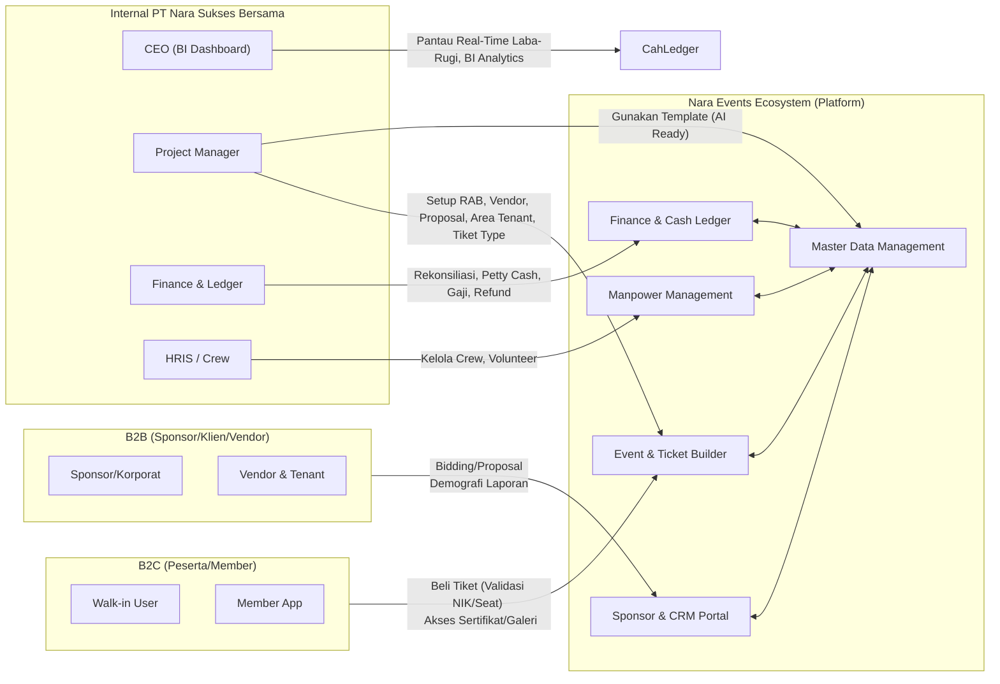

# docs/project/Overview/productContext.md - Konteks Produk

> **Dibuat oleh**: Product Manager Agent (Fase 1: Vision & Requirements)
> **Dibaca oleh**: Semua agen sebagai fondasi pemahaman produk

---

## 1. Problem Statement

PT. Nara Sukses Bersama mengelola berbagai skala dan model acara—mulai dari konser musik, pameran (bazaar), hingga workshop dan corporate event—namun proses dari hulu ke hilir (RAB, legal, ticketing, manajemen sponsor, hingga laporan keuangan) masih terpisah-pisah. Ketidakselarasan manajemen data, potensi kebocoran keuangan, kerumitan manajemen tiket yang bervariasi (seat map, perlindungan calo/NIK), dan pelaporan ke pihak B2B (Sponsor/Klien) memicu inefisiensi. Diperlukan sebuah "Super Ecosystem" berbasis Master Data Management (MDM) yang terpusat yang menggabungkan esensi ERP, CRM, HRIS, Ticketing, dan Finance Ledger guna memfasilitasi tim internal (promotor) klien korporat, entitas bisnis (sponsor/vendor), dan peserta acara dalam satu lingkungan sistem terintegrasi.

---

## 2. Tujuan Bisnis dan Metrik Keberhasilan

### 2.1 Tujuan Bisnis
1. **Penyatuan Sistem Operasional & Ticketing:** Menciptakan satu sumber kebenaran (single source of truth) untuk seluruh siklus acara, mulai dari proposal, pencarian sponsor, manajemen vendor, pengaturan area tiket dan tenant bazar, hingga pelaksanaan hari H (check-in via QR) dan pasca-acara.
2. **Implementasi Master Data Terpusat & Hot Create:** Membangun fondasi arsitektur data global (wilayah, rekening, data profil vendor/crew) yang digunakan secara konsisten di setiap lini operasi, di mana pembuatan data dapat dilakukan dengan cepat (misalnya lewat drawer/modal) tanpa menghilangkan validasi.
3. **Penyediaan Business Intelligence B2B & B2C:** Menyediakan wawasan analitik real-time mengenai performa acara dan demografi pengguna guna meyakinkan sponsor dan klien korporat, serta pelaporan keuangan yang komprehensif bagi C-Level.

### 2.2 Metrik Keberhasilan (KPI)
| Metrik | Target | Waktu Pengukuran | Metode Pengukuran |
|:---|:---|:---|:---|
| **End-to-End Traceability** | 100% biaya RAB terhubung ke *ledger* dan rekonsiliasi pembayaran. | H+7 pasca event | Audit Ledger vs Payment Gateway logs. |
| **Pencegahan Penyalahgunaan Tiket** | 0% tiket duplikat di gerbang *check-in* dan validasi NIK yang ketat di level profil. | Pada saat hari H acara | Log sistem gate check-in dan NIK binding pada tiket. |
| **Data Sponsor & Client Engagement** | Proses persetujuan/Bidding lebih cepat berkat penyediaan dasbor analitik dan histori acara. | Kuartal per kuartal | Metrik conversion rate proposal sponsor. |

---

## 3. Target Pengguna dan Persona Awal

### 3.1 Segmen Pengguna Utama
1. **Internal Team (C-Level, Project Manager, Finance, Crew)**: Perancang utama (pembuat RAB, skema tiket, proposal), pengelola keuangan (rekonsiliasi, petty cash, payroll/vendor payout), hingga pelaksana lapangan (volunteer, checker QR).
2. **Corporate Client & Sponsor (B2B)**: Pihak korporasi yang meminta acara custom (by client) atau mitra pendanaan (sponsor) yang butuh pandangan helikopter terkait demografi target pemasaran.
3. **Peserta Acara / Member (B2C)**: Penikmat acara (konser, pelatihan) yang butuh membeli tiket dengan aman, mengunduh sertifikat/galeri, maupun memesan acara reguler.
4. **Vendor & Rekanan Tenant**: Penyuplai alat berat, *production house*, artis, hingga penyewa ruang *tenant/bazar* di suatu acara.

### 3.2 Persona Pengguna

#### Persona 1: Internal PM (Project Manager)
- **Tujuan**: Merancang keseluruhan aspek manajemen event mulai dari master data, setup tiket, penentuan kapasitas, harga sewa *tenant*, skema sponsor, hingga plotting jadwal relawan dan karyawan tim.
- **Pain Points**: Sulit menyinkronkan data legal, RAB, dan progres vendor karena sistem tersebar.
- **Perilaku**: Bekerja dengan *deadline* ketat, butuh *template* siap pakai dan *hot-create* fitur saat data referensi belum ada.

#### Persona 2: Finance & Accounting
- **Tujuan**: Memastikan setiap uang masuk (dari payment gateway, penjualan *tenant*, *sponsor*) dan uang keluar (*petty cash*, pembayaran vendor, *refund*, gaji crew) tercatat akurat di general ledger dan sesuai prinsip akuntansi.
- **Pain Points**: Kesulitan mencocokkan data payment gateway tiket dengan rekonsiliasi internal. Proses pengembalian uang (*refund*) bisa bocor tanpa *audit trail*.
- **Perilaku**: Analitik bertumpu pada *dashboard* keuangan detail, audit trail, neraca, laporan L/R harian lintas-event atau global.

#### Persona 3: User Konser/Event (Member & Walk-In)
- **Tujuan**: Mendapatkan tiket incaran (misalnya tiket konser bernomor kursi, atau kelas festival), masuk venue tanpa masalah, dan mengunduh rekaman atau sertifikat edukasi secara serba *online*.
- **Pain Points**: Ketakutan tiket habis oleh calo. Ingin kemudahan *payment* (*QRIS/Virtual Account/Fallback tf*).
- **Perilaku**: Saat daftar wajib memberikan NIK (jika konser besar). User mungkin membelikan maksimal 5 tiket ke teman, butuh kolom nama, nomor WA, dan NIK spesifik untuk *holding ticket*.

---

## 4. Batasan yang Sudah Pasti

1. **Agnostik Tech Stack**: Desain produk tidak bergantung pada merek teknologi atau framework (React/Vue/Laravel) tertentu. Itu wilayah Tim Arsitek.
2. **Generative AI (Fase Produksi Mendatang)**: Fitur rekomendasi, penyusunan draf proposal, draft RAB berbasis AI masih dalam tahapan MVP, hanya berupa penyiapan kerangka (*schema template*) untuk diintegrasikan kemudian waktu.
3. **Strict Validation Ticket**: Penomoran kursi (*seat number*), NIK validasi, pembatasan jumlah pembelian maksimal per transaksi/per acara wajib ada sebagai kebijakan pencegahan percaloan.

---

## 5. Risiko Teridentifikasi

| Risiko | Likelihood | Impact | Mitigasi Awal |
|:---|:---|:---|:---|
| Transaksi Bersamaan Tinggi (Concurrency) saat presale konser. | Tinggi | Tinggi | Mekanisme antrean virtual (*queue*), reservasi stok tiket sementara (hold 10 menit time-to-pay), perancangan arsitektur antrean tiket. |
| Inkonsistensi Master Data akibat salah *"hot create"*. | Sedang | Sedang | Harus ada *approval flow* atau standar input wajib (provinsi/kota/rekening bank divalidasi API/dropdown terverifikasi). |
| Kegagalan Sistem Payment Gateway | Sedang | Tinggi | Sistem menyediakan *fallback* darurat pembayaran transfer manual (*upload* bukti Tf) dan notifikasi verifikasi manual oleh admin. |

---

## 6. Asumsi yang Perlu Divalidasi

1. Pelanggan korporat (By Client) tidak butuh skema pencarian Sponsor dalam modul manajemen event mereka.
2. Integrasi data wilayah geografis dapat memanfaatkan API independen siap pakai.
3. Refund manual lintas rekening mungkin memerlukan proses manual karena tidak semua payment gateway memiliki kapabilitas *auto-refund* B2C ke sembarang bank secara otomatis.

---

## 7. Diagram Konteks Produk

---

## 8. Catatan Versi

- [X] Versi: 1.0.0
- [X] Terakhir diperbarui: 2026-05-11
- [X] Dibuat oleh: Product Manager Agent
