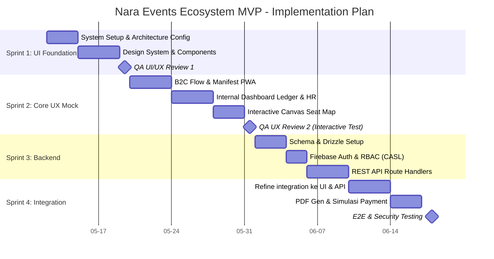

# docs/project/Roadmap/implementation-plan.md - Rencana Implementasi

> **Dibuat oleh**: Project Manager Agent (Fase 4: Execution Strategy)
> **Dibaca oleh**: Engineer Agent, Tech Lead

---

## 1. Strategi Pengembangan Eksekusi (The "UI-First" Approach)

Berdasarkan kesepakatan dengan Tech Lead, proyek ini **TIDAK** menggunakan pendekatan tradisional di mana *backend* dibangun berbarengan atau mendahului *frontend*. Guna menghindari *spaghetti code* dan memastikan *User Experience (UX)* tervalidasi secara manusiawi terlebih dahulu, metodologi yang digunakan adalah **UI-First with Mock Data (DTO based)**.

### Prinsip Eksekusi:
1. **Fase Presentational (UI/UX Mock):** Engineer membangun 100% komponen UI interaktif (Tombol, Modal, Drawer Hot Create, Seat Map Canvas) dengan *dummy data* berbentuk JSON DTO statis. Tidak ada relasi database aktif/fetching pada tahap ini. Tech Lead akan memvalidasi *feel*, transisi, dan *accessibility*.
2. **Fase Backend API:** Menyusun skema PostgreSQL (Drizzle) dan *Endpoint API Routes* independen yang mensimulasikan CRUD sesuai kontrak DTO yang disepakati di Fase Presentational.
3. **Fase Wiring & Integration:** Menghubungkan State (Refine / React Query) ke komponen Presentational, menukar *Mock Data* dengan *Live API*. Otorisasi (CASL) diaktifkan di sini.

---

## 2. Peta Jalan & Sprints (Roadmap MVP)

Pengembangan dibagi ke dalam 4 Sprint Utama untuk MVP.

### Sprint 1: Foundation & Design System (UI Only)
**Fokus:** Menyiapkan kerangka kerja visual (Tailwind v4, Shadcn, Next Themes) dan komponen inti Neo-Brutalism.
- [ ] Setup Next.js App Router, Tailwind v4, CSS Variables sesuai `tokens.json`.
- [ ] Setup komponen dasar (`Button`, `Inputs`, `Cards`, `Modal`, `Drawers`) bergaya Neo-Brutalism Rounded.
- [ ] Implementasi Dark/Light mode (`next-themes`).
- [ ] QA Visual (Tech Lead: Validasi kontras dan *click-feel* Neo-Brutalism).

### Sprint 2: Core UX Flows (Interactive UI Mocking)
**Fokus:** Membuat halaman-halaman utama menggunakan "Dummy Data" untuk pengujian UX (Seat Mapping & Hot Create).
- [ ] B2C: PWA Landing Page & Checkout Tiket Konser Manifest (Form dinamis NIK).
- [ ] PWA Check-In & Field Staff: Scanner UI mock, offline queue mock.
- [ ] Internal/B2B: Layout Backoffice Refine UI Mock (Ledger approval, Dynamic CMS, Kanban Pipeline CRM Leads).
- [ ] Interactive: Konva.js UI Mock Canvas untuk memetakan template Layout Event.
- [ ] Interactive: Drawer UX Mock untuk "Hot Create" di dalam elemen Select (Dropdown Master Data).
- [ ] QA UX (Tech Lead: Menguji flow secara klik prototipe react/next, validasi behavior modal dan form).

### Sprint 3: Backend, Database & Identity (Logic Core)
**Fokus:** Membangun *schema* berdasarkan DTO UI.
- [ ] Konfigurasi Neon PostgreSQL & Pembuatan Skema Drizzle ORM (Tabel Master Wilayah, Event, Tiket, Vendor, Ledger, Payout).
- [ ] Integrasi Firebase Auth dan RBAC.
- [ ] Penulisan Next.js REST API Route Handlers untuk semua manipulasi data.
- [ ] Pembuatan middleware validasi JWT/Session ke CASL Polices.

### Sprint 4: Wiring & Live Testing (Integration)
**Fokus:** Menyuntikkan fungsionalitas nyata ke kerangka presentasional.
- [ ] Hubungkan `Refine.dev` *Data Provider* agar menarik data via API yg dikonfigurasi.
- [ ] Integrasikan Submit Form/Drawers ke Endpoint `/api/*` untuk *Hot Create* sungguhan.
- [ ] Integrasi Dummy Payment Gateway API webhook.
- [ ] End-to-End Testing (Booking -> Payment -> Invoice -> PDF Generation -> Ledger L/R Record).

---

## 3. Sprint Timeline (Gantt Chart)

### Stage 2: Full Production Ready & Scale (Post-MVP)
Setelah MVP tervalidasi secara manusiawi dan fungsional di Sprint 4, peta jalan akan berlanjut ke tahap *Production Readiness* untuk skala besar.
- **Sprint 5: Security Hardening & Performance Tuning**: Implementasi *Database Indexing*, Caching (Redis/Vercel KV), Rate Limiting pada API, serta *Penetration Testing* (khususnya celah Ledger dan otorisasi NIK).
- **Sprint 6: Observability & CI/CD Pipeline**: Setup monitoring (Sentry untuk error tracking, PostHog/Google Analytics untuk behavior tracking) dan otomatisasi *deployment pipelines* (GitHub Actions) untuk *zero-downtime deployment*.
- **Sprint 7: Mobile API Stabilization**: Pembekuan dan versioning endpoint (`/api/v1/...`), serta pembuatan dokumentasi API otomatis (Swagger/OpenAPI) sebagai persiapan tim Native Mobile App (iOS/Android) bekerja.

---

## 4. Struktur Tim (Agent Context)
Selama Fase 5 (Implementasi), *Engineer Agent* dilarang melakukan pekerjaan *full-stack* sekaligus di satu file. Implementasi **harus** dilakukan di tingkat `UI/Component` dulu secara terisolasi hingga Tech Lead menyetujui, sebelum menyentuh file `/api/...` dan sinkronisasi state server-side.

---

## 5. Catatan Rilis

- **Versi**: 2.0.0 (UI-First Approach Adjusted)
- **Terakhir Diperbarui**: 2026-05-11
- **Pemilik**: Project Manager Agent
