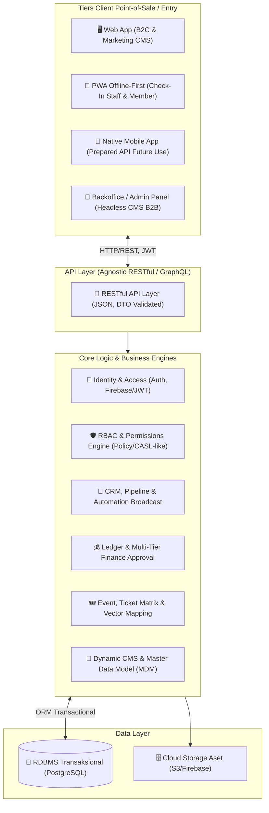
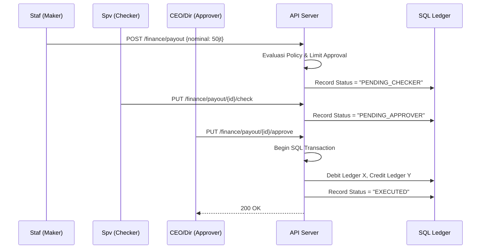

# Technical Architecture

**🔥 ABSOLUTE DIRECTIVE (KORIDOR MUTLAK UNTUK NEXT AI):**
Dokumen arsitektur ini mendeskripsikan cetak biru teknis. Jika Anda (AI) di-instruksikan untuk berpindah stack (misalnya dari Next.js ke Laravel/Nuxt/Go), Anda **WAJIB** mengekstrapolasi prinsip-prinsip arsitektur di bawah ini (API-First, Headless CMS, RBAC, Relasional DTO) ke ekosistem yang baru TANPA harus memvalidasi ulang esensi bisnisnya dengan User. Konsep ini adalah sumber kebenaran teknis (*Single Source of Truth*).

---

## 1. Executive Summary

Arsitektur aplikasi Nara Events Ekosistem dirancang menggunakan pendekatan modern **API-First** dan **Serverless Ready**. Sistem menggabungkan kapabilitas **Headless CMS & Data-Driven UI** (mirip Laravel Filament/Nova) menggunakan `refine.dev`, dengan database transaksional relasional (PostgreSQL) melalui struktur ORM. Hal ini menjamin fleksibilitas penyajian B2B (Backoffice), B2C (PWA/Web app), dan kemudahan integrasi untuk Native Mobile App di masa depan.

## 2. High-Level Architecture Diagram (Agnostic Conceptual)

## 3. Komponen Inti Modular & Tanggung Jawab

| Modul Area | Cakupan Logika Backend & Desain Agnostik |
|:---|:---|
| **Identity & Security** | Penanganan Auth (Google Login/Email). Wajib ada Authorization layer model *Policy/Gate* (RBAC) yang mencegah modifikasi resource berdasarkan kepemilikan dan Role (Admin/Promotor/Finance). |
| **Master Data Management (MDM)** | Penyediaan endpoint CRUD universal untuk data master, siap di-intercept oleh fitur "Hot Create" (misal: saat memilih dropdown vendor, bisa membuat record vendor baru via Modal/Drawer). |
| **CRM & Automation** | Memproses trigger webhook atau event-listener backend. Contoh: Jika stage leads di Kanban pindah ke "Follow Up", pemicu *job queue* API pihak ketiga untuk WA Broadcast aktif. |
| **Finance Ledger (Double Entry)** | Operasi ke DB wajib dibungkus dalam entitas transaksi Database (Rollback jika `save()` gagal). Menyediakan sistem persetujuan (Maker -> Checker -> Approver) dengan batasan nominal (Limit Tiers). |
| **Headless CMS & UI State** | Bagian depan (Frontend B2B) berjalan di kerangka layaknya Filament di ekosistem React (`refine.dev`), menyerap metadata model data untuk membentuk Data Grid, Filter, dan Edit panel dinamis. |
| **Interactive Event Seating** | Mengandalkan arsitektur Canvas/WebGL (`react-konva`). Koordinat (X, Y, Status, Tipe) vektor layout kursi diserialisasi menjadi tipe JSON sebelum di-*post* ke database relasional. |
| **PWA Service Worker** | Menangani mitigasi caching dan antrean request check-in `POST` (IndexedDB lokal) yang menumpuk saat koneksi petugas (*field staff*) terputus. |

## 4. Stack Aktap / Terpilih Saat Ini (MVP)
*Walaupun desain sistem bersifat agnostik, implementasi konkrit pada platform AI Studio saat ini adalah:*
- **Meta-Framework**: Next.js App Router (TypeScript).
- **Backend/API**: Next.js Route Handlers + Zod Validation.
- **Database Layer**: Neon Serverless PostgreSQL + Drizzle ORM.
- **Backoffice Framework**: Refine.dev (Headless mode) + Shadcn UI (Neo-brutalism).
- **Auth & Storage**: Firebase Authentication + Firebase Storage.
- **Interactive UI DND**: dnd-kit (CRM Pipeline), react-konva (Vector Seat Mapping).
- **Offline PWA**: Serwist.

## 5. Security & Multi-Tier Finance Approval (Flow)

Semua tindakan finansial yang mencairkan dana / refund di backend WAJIB melewati mekanisme *Gate*:

---
**Catatan Versi:** 2.0 (Super Robust & Agnostic Deep Dive Audit)
**Update:** 2026-05-11
