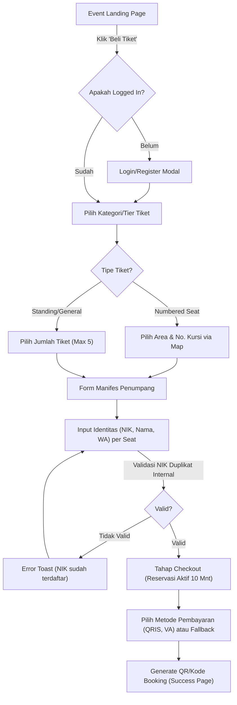
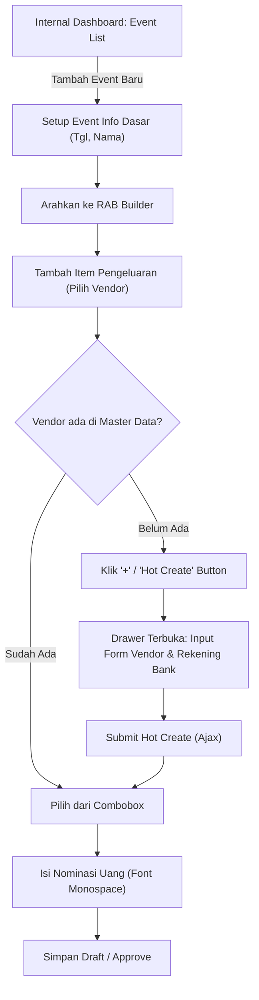

# docs/project/Spec/ux-spec.md - UX Specification

> **Dibuat oleh**: UI/UX Designer Agent (Fase 2: Design & Experience)
> **Dibaca oleh**: Technical Architect, Project Manager, Engineer

---

## 1. Executive Summary

UX Specification ini menjabarkan anatomi antarmuka Nara Events. Terdapat 3 "Dunia" antarmuka utama:
1. **Public/B2C Area**: Landing page, detail event, dan proses check-out (seat selection & NIK input) bergaya Neo-Brutalism ekstrim yang menggugah selera festival.
2. **Dashboard Member**: Portal privat peserta (B2C) untuk mengunduh tiket (QR), materi, dan sertifikat (UI lebih redup dan fungsional).
3. **Internal/B2B Area**: ERP (Event Builder, Ledger, CRM) dan Vendor Portal. Padat data (data-dense) mengandalkan font monospace untuk akurasi data. Mewajibkan integrasi komponen "Hot Create" di setiap input referensial.

---

## 2. User Flow Diagrams

### 2.1 Flow B2C: Pembelian Tiket Konser (Validasi NIK)



### 2.2 Flow Internal (B2B): Event Setup & Hot Create Vendor

Fitur khas sistem ini adalah master-data tersentralisasi.



---

## 3. Wireframe Descriptions & Screen Anatomy

### 3.1 B2C - Event Details & Manifest Checkout

**Tujuan**: Membantu member B2C mengamankan tiket dengan cepat dan memastikan validasi NIK yang benar sebelum checkout.

**Anatomi Layar**:
- **Header**: Sticky Navbar (Border bawah 2px hitam solid), logo NARA, Profile Avatar, dan *Marquee banner* promosi event.
- **Main Container**:
  - Kolom Kiri (70%): Map area venue interaktif (SVG). Area yang di-klik memperlihatkan panel sisa seat. 
  - Kolom Kanan (30%): Form Sticky "My Order". Berisi list tiket ter-klik.
- **Manifest Modal (Overlay Pekat)**:
  - Setelah klik 'Lanjutkan', layar diredupkan `rgba(0,0,0,0.8)`. Panel putih neo-brutal (border tebal) di tengah.
  - Berisi perulangan `<Card>` sebanyak X tiket. Masing-masing meminta `Input Label="NIK KTP"`, `Input Label="Nama Lengkap"`, `Input Label="WhatsApp"`.
  - Tombol Action utama: "KUNCI & BAYAR SEKARANG" (Primary Lime).

### 3.2 Internal - Ledger & RAB Dashboard

**Tujuan**: Membantu PM dan Tim Keuangan memantau pendapatan, Laba-rugi (L/R) dan mengelola vendor pengeluaran tanpa pindah halaman (Hot Create).

**Anatomi Layar**:
- **Sidebar**: Navigasi vertikal gelap (Navy Bg), menu ERP (Proyek, Finance, HRIS, Database Master).
- **Header**: Global Search bar, Alert Notification (Persetujuan Petty Cash).
- **Main View (RAB Table)**:
  - Header data menggunakan Space Grotesk.
  - Row tabel strip zebra. Kolom "Anggaran" dan "Realisasi" memakai `IBM Plex Mono` (right-aligned).
  - Terdapat tombol `+ Tambah Baris RAB`. Ketika di-klik, sel tabel akan menjadi editable (input field dengan border hitam).
  - Pada field "Pilih Vendor/Penerima", list combobox memiliki statis row di paling atas: `+ Buat Penerima Baru`. Menu ini men-trigger *Side Drawer* (Laci Samping) untuk input no. rekening secara instan.

### 3.3 B2C - My Tickets (Mobile Web Prioritized)

**Tujuan**: Ditampilkan penuh saat di loket konser. Membesarkan ukuran QR Code.

**Anatomi Layar**:
- **Mobile First Focus**: Latar belakang putih bersih. Layout tiket seperti boarding pass.
- Terdapat garis potong zig-zag (efek border).
- Area atas: Judul Konser (Space Grotesk), Nomor Seat (sangat besar, monospace).
- Area tengah: **QR Code** (Ukuran raksasa), dan keterangan di bawah "ID: [NIK Disensor ***551]".
- Area bawah: Tombol Secondary (Violet) -> "Download PDF / Sertifikat".

---

## 4. Mockup Data & State Matrix

### 4.1 Ledger Item (Financial Record)

```json
{
  "id": "ldgr-2026-90xa",
  "eventId": "evt-jx09",
  "type": "EXPENSE",
  "category": "VENDOR_PAYOUT",
  "entityId": "vndr-122", // FK -> Master vendor
  "nominal": 8500000.00, // Harus divalidasi dan align-right
  "status": "APPROVED",
  "audit": {
    "createdBy": "usr-888 (PM)",
    "approvedBy": "usr-102 (Finance)",
    "timestamp": "2026-05-11T12:00:00Z"
  }
}
```

### 4.2 State Matrix (Input Field dengan Hot Create)

| State | Kondisi Layer | Visual Treatment |
|:---|:---|:---|
| **Empty** | Field kosong, belum dipilih | Placeholder abu-abu, border 2px solid black. |
| **Focused / Searching**| Sedang diketik (AJAX cari vendor) | Muncul dropdown. Item pertama: "+ Tambah Baru". Shadow neo-brutal membesar. |
| **Hot-Create Active**| Tombol "+" diklik | Layar diredupkan, Drawer kanan muncul. Input form sub-level aktif. Memblokir interaksi latar belakang. |
| **Success Relasi**| Data vendor baru tersimpan | Drawer tertutup. Input Field terisi nama Vendor Baru. Border hijau neon 2px kilat 1 detik (animasi). |
| **Error DBL** | NIK pembeli tiket duplikat di event | TextField terguncang (shake), text dan border merah. Teks help: "NIK ini sudah memegang tiket." |

---

## 5. Accessibility & Mobile Validation

- **Mobile-First & Zoom**: Resolusi layar sempit (hape) tidak ideal untuk SVG raksasa. *Pinch-to-zoom* pada seat-map SVG harus diaktifkan secara native di library D3/PinchZoom.
- **Kontras**: Teks Lime pada Putih dihindari. Warna Lime `#ccff00` selalu dipadankan dengan teks Hitam `#000000` atau background gelap `#0a192f` untuk kontras yang diizinkan standar AA.
- **Tap Area**: Khusus antarmuka check-in (scanner QR petugas gate) dan aplikasi web utamanya, secara mobile-first area sentuh tombol interaktif setidaknya ukuran minimum `44px` x `44px` sesuai mandat tap area thumb zone aksesibilitas.
- **WAI-ARIA Accessibility**: Diperlukan di setiap elemen form / modal. Termasuk navigasi keyboard `Esc` untuk menutup drawer / alert modal.

---

## 6. Catatan Versi

- [X] Versi: 1.0.0
- [X] Terakhir diperbarui: 2026-05-11
- [X] Dibuat oleh: UI/UX Designer Agent
